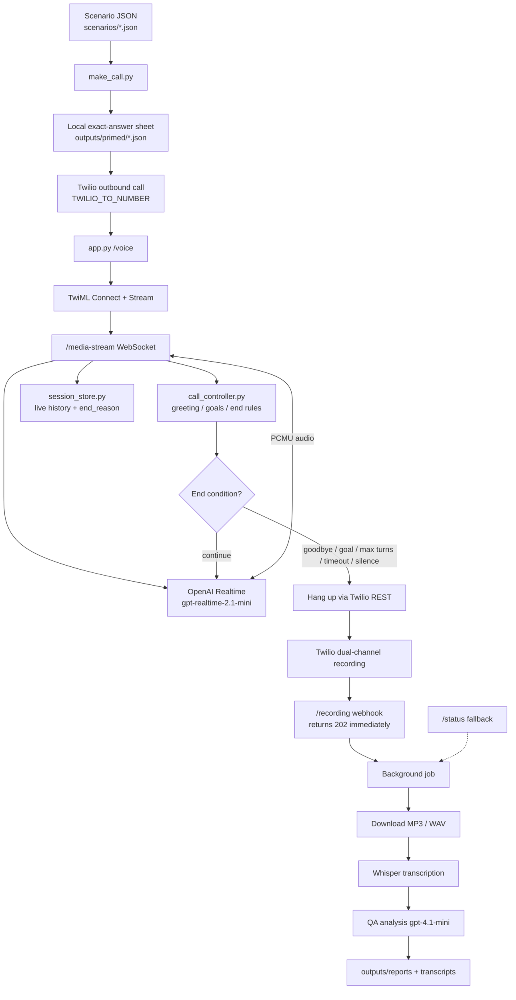

# Patient Voice QA Bot

An automated **patient simulator** that calls a clinic AI agent, holds a realistic conversation, records both sides, and scores the agent for bugs and quality issues.

Built for outbound testing with Twilio Media Streams + OpenAI Realtime.

---

## Logic diagram



### What each stage owns

| Stage | Owner | Job |
|---|---|---|
| Facts | Scenario JSON + local exact-answer sheet | Exact patient identity, opening, goals |
| Live voice | OpenAI Realtime | Natural spoken patient replies |
| Guardrails | `call_controller.py` | When to speak, when to stop, why it ended |
| Call transport | Twilio Media Streams | Bidirectional audio bridge |
| Evidence | Dual recording + Whisper | Full conversation transcript |
| Judgment | `analyze.py` | Score clinic agent quality / bugs |

---

## Why this design

- **No fake pre-call “training” session** — Realtime does not keep a temporary WebSocket across dial. Facts are prepared locally and injected into the live session.
- **Deterministic control, generative speech** — code decides turn limits and end reasons; the model only phrases the patient.
- **Greeting-first** — the patient stays silent until the clinic speaks.
- **Async post-call pipeline** — `/recording` acknowledges immediately so Twilio does not time out during Whisper + QA.

---

## Setup

```powershell
cd E:\twillioTest
pip install -r requirements.txt
copy .env.example .env
```

Fill `.env`:

- Twilio: `TWILIO_ACCOUNT_SID`, `TWILIO_AUTH_TOKEN`, `TWILIO_FROM_NUMBER`, `TWILIO_TO_NUMBER`
- Public URL: `PUBLIC_BASE_URL` (ngrok HTTPS)
- OpenAI: `OPENAI_API_KEY`

Never commit `.env`.

---

## Run (3 terminals)

**1. Server**

```powershell
python app.py
```

**2. Public tunnel**

```powershell
ngrok http 5000
```

Put the ngrok HTTPS URL into `PUBLIC_BASE_URL`.

**3. Place a call**

```powershell
python make_call.py --list
python make_call.py --scenario scheduling
```

### Useful flags

```powershell
# Prepare exact-answer sheet only (no OpenAI, no phone call)
python make_call.py --scenario billing --train-only

# Validate config without dialing
python make_call.py --scenario scheduling --dry-run

# Reuse existing primed JSON if scenario is unchanged
python make_call.py --scenario scheduling --skip-train
```

---

## Scenarios

| ID | Intent |
|---|---|
| `scheduling` | Book a routine visit |
| `refill` | Request a prescription refill |
| `billing` | Question an unexpected balance |
| `reschedule` | Move an existing appointment |
| `new_injury` | Triage a new ankle injury |

Each scenario defines persona, opening line, facts, goals, edge cases, success criteria, and completion signals.

---

## Models

| Stage | Model | Purpose |
|---|---|---|
| Live patient voice | `gpt-realtime-2.1-mini` | Speech-to-speech patient |
| Live input transcripts | `gpt-4o-mini-transcribe` | Clinic speech during the call |
| Full recording STT | `whisper-1` | Post-call transcript |
| QA report | `gpt-4.1-mini` | Bug / quality scoring |

---

## Outputs

```text
recordings\{CallSid}.mp3          # dual-channel call audio
outputs\calls\{CallSid}.json      # live history + controller state
outputs\primed\{scenario}.json    # local exact-answer sheet
outputs\transcripts\{CallSid}.txt # Whisper transcript
outputs\reports\{CallSid}.json    # structured QA report
outputs\reports\{CallSid}.md      # human-readable report
```

### If the recording webhook was missed

```powershell
python fetch_recording.py -c CAxxxxxxxx
python transcribe.py recordings\CAxxxxxxxx.mp3 --call-sid CAxxxxxxxx
python analyze.py outputs\transcripts\CAxxxxxxxx.txt --call-sid CAxxxxxxxx --scenario scenarios\scheduling.json
```

---

## End reasons

The call ends for an explicit reason stored in the session:

| `end_reason` | Meaning |
|---|---|
| `patient_goodbye` | Patient said goodbye |
| `goal_completed` | Clinic hit a completion signal, then patient closed |
| `max_patient_turns` | Scenario turn budget reached |
| `max_call_seconds` | Hard duration limit hit |
| `repeated_silence` | Idle timeout |

---

## Project map

```text
make_call.py         Dial + local scenario preparation
app.py               FastAPI webhooks + Realtime media bridge
patient_brain.py     Scenario load + exact-answer sheet
realtime_bridge.py   Realtime session instructions / config
call_controller.py   Deterministic greeting / goal / end rules
session_store.py     Per-call history persistence
transcribe.py        Whisper transcription
analyze.py           Post-call QA scoring
fetch_recording.py   Manual recording download fallback
scenarios/           Patient personas and scripts
```

---

## Safety

- Destination comes from `TWILIO_TO_NUMBER` in `.env`
- Patient answers only from the local exact-answer sheet
- Missing facts → “I don’t have that information”
- No medical advice, no invented IDs / balances / dates
- No dial or transfer tools exposed to the model
